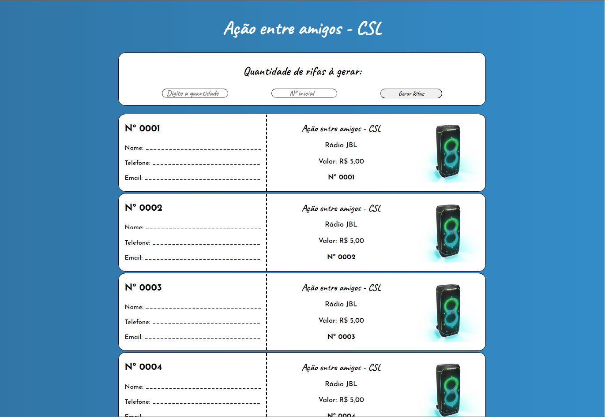

# Rifa-PHP Project




<p> This project was the first project using PHP that I did in the IT technical course. The objective of this project is to develop a web page that can create some
raffle tickets for printing, allowing you to select the quantity to print and the initial number of tickets.</p>

## 💻 Prerequisites

Before start, check if you have the requisites below:

- You have XAMPP installed,

## 🚀 Installation

To running this webpage, follow these steps:

- Access the path where XAMPP are installed, and access the htdocs folder:

```
"C:\xampp\htdocs"
```

- Create a new folder inside htdocs and create a php file, and copy/paste the content of my rifa.php archive of the github

- Create a new styles.css file and copy/paste the content of my styles.css file of the github

- After this open your server control pannel (XAMPP Control Pannel), start Apache service

- And in your browser, type on navigation bar the path:

```
localhost/{name of the folder you created inside htdocs}/{name.php of the php archive that contains the webpage}
```
